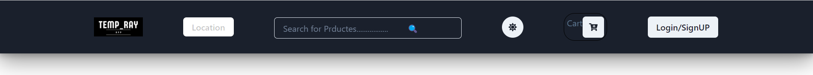
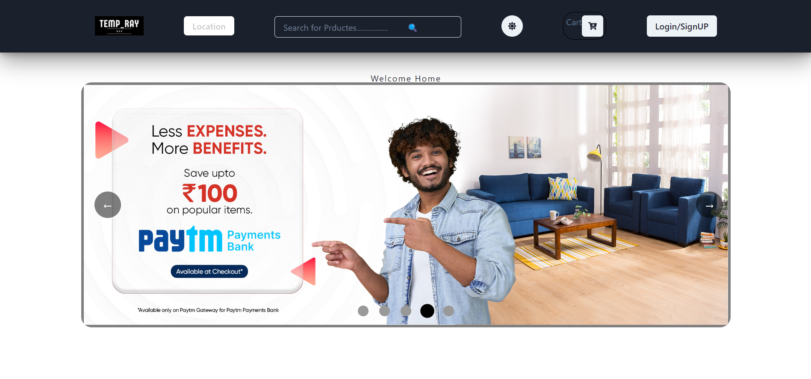
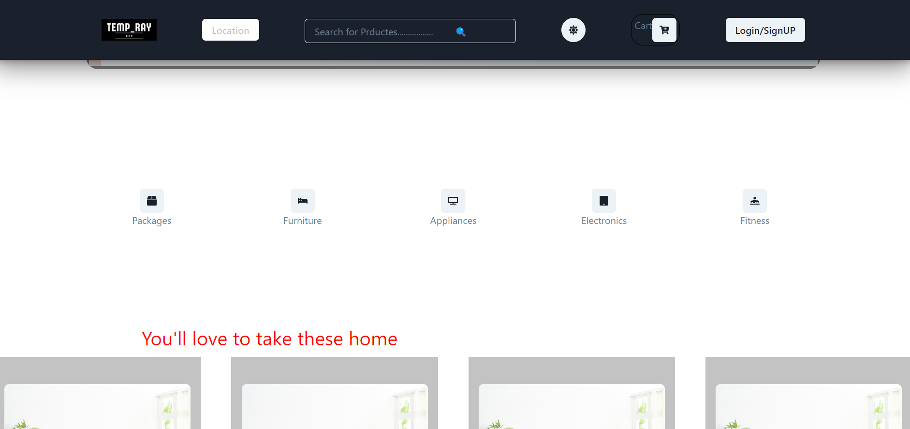
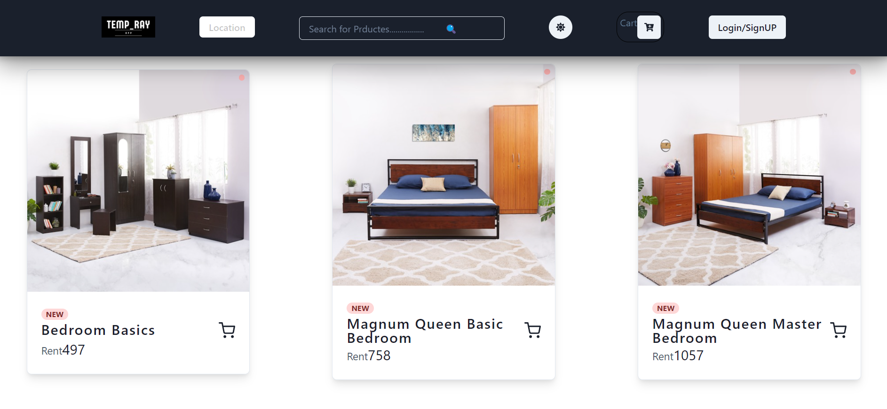
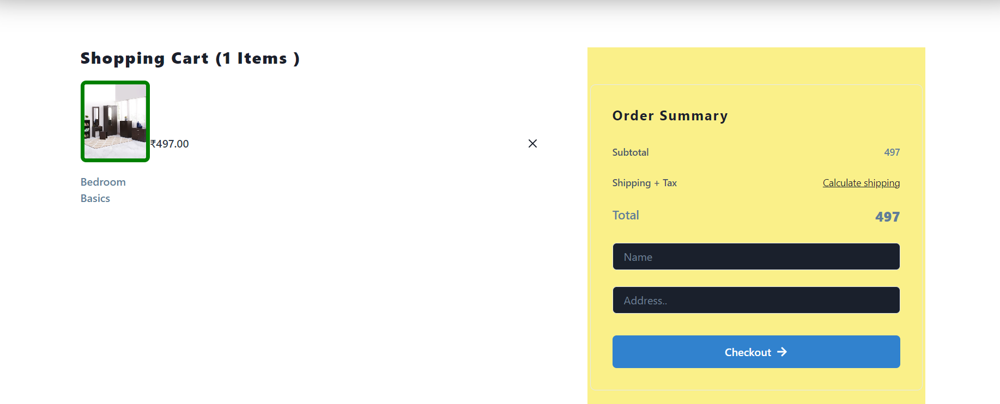

# Temp_Ray-app -

React Project

ownner :Jith stephen..

# 💻 Tech Stack:
   !       

<h3 align="center"><a href="https://tem-ray-app.netlify.app/"><strong>Want to see live preview »</strong></a></h3>

 
  

It is the clone of Rentmojo.com this website provides furniture and appliance for rent
This Project was individually built by me and it was completed within just 5 days
  

 
#  Features: Home Page, Admin page, Login/Sign up Page,Navbar,Product page, Cart Page , Footer

- Our LOGO :
   
 

## Tech-Stack:

- React.js
- React Routing
- React Redux
- React Redux Thunk
- CSS
- HTML
- Chakra UI Library
- Firebase

Glimpse and Screenshots of our cloned website:

## Navbar:

## Home Page:

## Product categery:

## Product Sub-categery:

## Pdoduct Detailes Page:

 

## Cart 

## Admin:

- 

